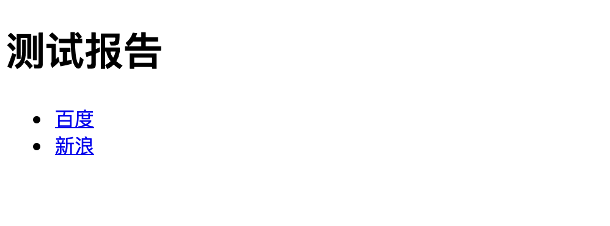
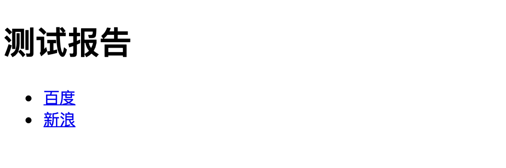

## 测试报告种类

- 纯文本
- Excel
- 图片
- HTML

HTML 报告样式美观，可展示数据形式多，查看方便。


## HTML测试报告

HTML测试报告一般的生成方式有

1. 定义模板，生成测试数据，由模板引擎完全渲染出完整的页面。该 HTML 的内容已经完全包含在文件中，无需在浏览器里再处理，直接渲染出即可。
2. 同方式一流程相同，但是模板定义和由模板引擎渲染的数据不同。模板引擎只负责把数据渲染到报告中，数据的处理以及页面的进一步处理由 JS 来进行。

## 第一种方式

模板定义

```html
<!DOCTYPE html>
<html lang="en">
<head>
    <meta charset="UTF-8">
    <title>Report</title>
</head>
<body>

<h1>{{ title }}</h1>
<div id="list">
    <ul>
        
        <li><a href="{{ item['href'] }}">{{ item['address'] }}</a></li>
        
    </ul>
</div>

</body>
</html>
```

代码渲染

```python
from jinja2 import Template

if __name__ == '__main__':
    with open('no_js_template.html', encoding='utf-8') as f:
        report_template = f.read()

    template = Template(report_template)
    report = template.render(
        title='测试报告',
        items=[
            {
                'href': 'www.baidu.com',
                'address': '百度'
            },
            {
                'href': 'www.sina.com',
                'address': '新浪'
            }
        ]
    )

    with open('report.html', 'w', encoding='utf-8') as f:
        f.write(report)
```

渲染后的 HTML

```html
<!DOCTYPE html>
<html lang="en">
<head>
    <meta charset="UTF-8">
    <title>Report</title>
</head>
<body>

<h1>测试报告</h1>
<div id="list">
    <ul>
        
        <li><a href="www.baidu.com">百度</a></li>
        
        <li><a href="www.sina.com">新浪</a></li>
        
    </ul>
</div>

</body>
</html>
```

最终效果



可以看出，最终 HTML 的标签都是已经全部由模板引擎生成，只需浏览器根据标签生成 DOM 元素展示在页面上。

## 第二种方式

模板定义

```html
<!DOCTYPE html>
<html lang="en">
<head>
    <meta charset="UTF-8">
    <title>Report</title>
</head>
<body>

<div id="list" x-data="app()">
    <h1 x-text="data.title"></h1>
    <ul>
        <template x-for="(item, index) in data.items" :key="index">
            <li><a x-bind:href="item.href" x-text="item.address"></a></li>
        </template>
    </ul>
</div>

<!--引用 alpine js-->
<script src="https://cdn.jsdelivr.net/gh/alpinejs/alpine@v2.8.0/dist/alpine.min.js" defer></script>

<script type="text/javascript">
    var data = '{"title": "测试报告", "items": [{"href": "www.baidu.com", "address": "百度"}, {"href": "www.sina.com", "address": "新浪"}]}';

    var jsObject = JSON.parse(data);

    function app() {
        return {
            data: jsObject,
        }
    }
</script>
</body>
</html>
```

代码渲染

```python
# -*- coding: utf-8 -*-
import json

from jinja2 import Template

if __name__ == '__main__':
    with open('use_js_template.html', encoding='utf-8') as f:
        report_template = f.read()

    template = Template(report_template)

    render_data = {
        'title': '测试报告',
        'items': [
            {
                'href': 'www.baidu.com',
                'address': '百度'
            },
            {
                'href': 'www.sina.com',
                'address': '新浪'
            }
        ]
    }

    report = template.render(data=json.dumps(render_data, ensure_ascii=False))  # ensure_ascii=False 避免非 ASCII 字符转换

    with open('report.html', 'w', encoding='utf-8') as f:
        f.write(report)
```

渲染后的 HTML

```html
<!DOCTYPE html>
<html lang="en">
<head>
    <meta charset="UTF-8">
    <title>Report</title>
</head>
<body>

<div id="list" x-data="app()">
    <h1 x-text="data.title"></h1>
    <ul>
        <template x-for="(item, index) in data.items" :key="index">
            <li><a x-bind:href="item.href" x-text="item.address"></a></li>
        </template>
    </ul>
</div>

<!--引用 alpine js-->
<script src="https://cdn.jsdelivr.net/gh/alpinejs/alpine@v2.8.0/dist/alpine.min.js" defer></script>

<script type="text/javascript">
    var data = '{"title": "测试报告", "items": [{"href": "www.baidu.com", "address": "百度"}, {"href": "www.sina.com", "address": "新浪"}]}';

    var jsObject = JSON.parse(data);

    function app() {
        return {
            data: jsObject,
        }
    }
</script>
</body>
</html>
```
最终效果



可以看出，模板引擎只向最终的 HTML 渲染了数据，模板中也只定义了骨架，最终是在浏览器里由 JS 生成了完整的内容然后浏览器渲染出来。

## 类比

第一种方式类似 web 开发方式中的后端渲染，由后端生成页面的所有内容。

第二种方式类似 web 开发方式中的前端渲染，由前端生成部分页面内容。

当然，两种方式结合也是可以的。

## 适合的 JS 库

- alpinejs 简单，轻量，可以无需编译。
- vuejs(vue2 或 vue3) 入手简单，可以无需编译。

## 适合的 CSS 库

- bootstrap
- tailwind
- element 配合 vue2
- element-plus 配合 vue3
